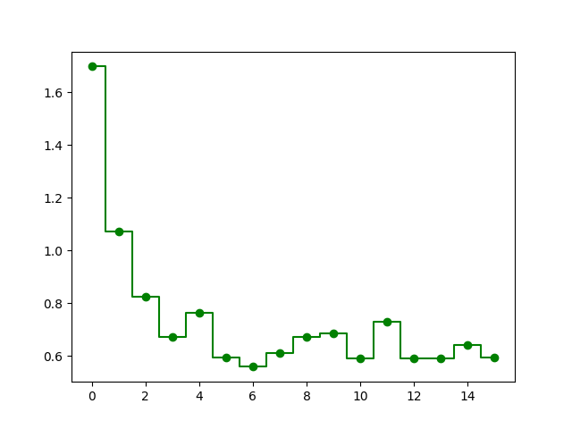

# Звіт з лабораторної роботи №1<br>за дисципліною "Паралельні та розподілені обчислення"<br>студента групи ПА-18-2<br>Лобань Ганни Максимівни<br>Кафедра комп'ютерних технологій<br>ФПМ, ДНУ, 2020-2021 навч.р.

## Постановка задачі. Використання OpenMP

* Напишіть програму на мові C для обчислення скалярного добутку двох векторів типу `double`.  
Розмір векторів виберіть таким чином, щоб вони займали половину оперативної пам'яті.
* Модифікуйте даний алгоритм за допомогою прагми OpenMP і виконайте програму з використанням різної кількості нитей.
* Обчисліть час виконання і проаналізуйте отримані результати.

## Хід розв'язку

Для розв'язку цієї задачі було розроблено програму на мові C, яка зчитує дані з конфіг-файлу (за замовчуванням - `config.txt`) 
та спочатку генерує пару векторів наперед заданого розміру (є можливість указувати одиниці виміру: `b` або `B` для байтів, `k` або `K` для
кілобібайтів, KiB (1 KiB = 1024 байтів), `m` або `M` для мегабібайтів, MiB (1 MiB = 1024 KiB), `g` або `G` для гігабібайтів, GiB (1 GiB = 1024 MiB).
Також у конфіг-файлі можна указати кількість потоків, які будуть застосовуватися для паралелльних обчислень.

Приклад кофігураційного файлу:

```
SIZE=256
MODE=m
THREADS=8
MP_ON=0
OUTPUT=output.txt
```

У данному випадку на кожний вектор буде виділено 256 MiB та обрано 8 потоків, але так як `MP_ON=0`, то розпаралелювання вимкнено. Вивід часу, затраченого
на вирахування скалярного добутку, відбувається у файл `output.txt`.

Для автоматизації запуску програми з декількома параметрами та аналізу данних, було написано ще два додактові скрипта: `runme.sh`, який потрібно запускати, та
`create_graph.py`, який бере дані з файлу з часом, будує, зберігає та показує графік (приклад буде далі).

Тепер запустимо скрипт `runme.sh`. Вводимо дані, які він запрошує: 4 GiB, 16 потоків, після чого вона модифікує файл конфігу. Після цього скрипт намагається 
скомпілювати програму (за необхідності), видаляє (якщо є) файл `output.txt` та у циклі запускає основну програму, заміняючи кожен раз кількість потоків у 
конфіг-файлі на таке, що між 1 та 16. Кожен раз після виконання програма пише до `output.txt` час у секундах, який вона витратила на ці операції. Після цього, 
скрипт запускає відповідний скрипт на мові Python, який бере цей файл, витаскує з нього ці значення та будує наступний графік:



## Аналіз результатів і висновок

Ми ясно бачимо, що хоч після рахування на потоках, яких точно більше за 2, значення дивно коливаються, але в середньому використання більш ніж 2, а тим більше 1 
потоків, програє в ефективності використанню 3+. До того ж, на комп'ютере в цей час можуть запускатися інші різні процеси, які потребляють ресурси процессору.

## Вихідні файли програми

* Програма на С:
  - [include/app.h](Lab01/include/app.h)
  - [include/double_vector.h](Lab01/include/double_vector.h)
  - [src/main.c](Lab01/src/main.c)
  - [src/app.c](Lab01/src/app.c)
  - [src/double_vector.c](Lab01/src/double_vector.c)
* Скрипт для створення графіку:
  - [create_graph.py](create_graph.py)
* Скрипт для автоматизації:
  - [runme.sh](runme.sh)
