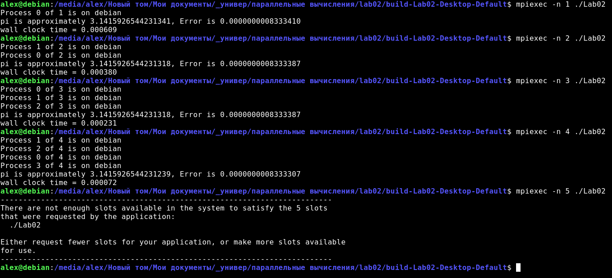
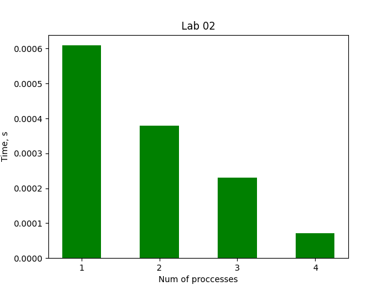

# Звіт з лабораторної роботи №1 за дисципліною "Паралельні та розподілені обчислення" студента групи ПА-18-2 Лобань Ганни Максимівни Кафедра комп'ютерних технологій ФПМ, ДНУ, 2020-2021 навч.р. 

## Постановка задачі. Налаштування MPI API в ОС Windows

* Встановіть MPICH останньої версії, який можна загрузити з сайтуhttp://www.mcs.anl.gov/research/projects/mpich2/

* Вивчіть правила виклику програми `mpiexec`

* Відкомпілюйте і виконайте тестову програму `pi.c` з різною кількість процесів на одному компютері.

## Хід розв'язку

Вихідний код MPI поступає з директорією `examples/`, де можна знайти файл `cpi.c`, який представляє собою
стандартний приклад використання MPI. Після встановлення відповідного пакеті, прив'язки у `CMakeLists.txt`
потрібних бібліотек, компілюємо програму, переходимо до директорії, де знаходиться програма, та викликаємо
`mpiexec` с параметром `-n`, що дозволяє вказати кількість процесів, що буде застосовуватися. Повний
мануал з усіма аргументами знаходиться [тут](https://www.mpich.org/static/docs/v3.1/www1/mpiexec.html).
В цілому, можна вказати такі речі, як:

*  де виконувати програму (`-host <hostname>`)
*  тип архітектури (`-arch <architecture name>`)
*  активну директорію, куди потрібно перейти до виконання програми (`-wdir <working directory>`)
*  шлях до бінарного файлу (`-path <pathlist>`)
*  тощо.

## Аналіз результатів і висновок

Після виконання програми `pi.c` за допомогою `mpiexec`, маємо наступне:

Як бачимо, відчувається покращення при збільшенні кількості доступних потоків. Максимальну кількість, яку мені вдалося
виконати, була 4. Це можна показати графічно:

## Вихідні файли програми

[Посилання на GitHub](https://github.com/AlexValder/PARALLEL_CALCULATIONS_Labs/tree/master/lab02)

*  Програма на С:
   *  [CMakeLists.txt](Lab02/CMakeLists.txt)
   *  [src/pi.c](Lab02/src/pi.c)

